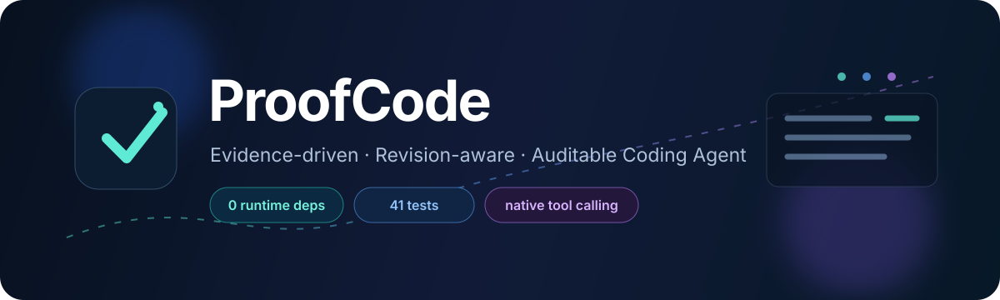
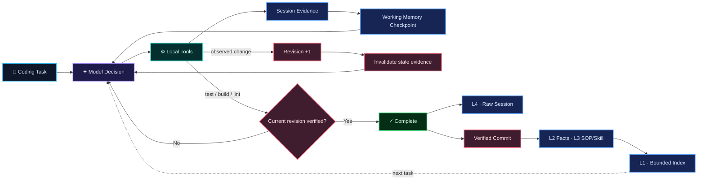

<div align="center">
  

  <br/>

  <a href="#-quick-start"></a>
  <a href="#-testing--evaluation"></a>
  <a href="#-design-principles"></a>
  <a href="#-quick-start"></a>

  <br/><br/>

  <strong>一个轻量、可审计、由执行证据驱动的编程智能体。</strong><br/>
  <sub>不把“模型说完成了”当作完成。工作区发生可观测变化后，必须取得当前 revision 的项目级执行证据。</sub>

  <br/><br/>

  <a href="#-why-proofcode">Why ProofCode</a> ·
  <a href="#-architecture">Architecture</a> ·
  <a href="#-quick-start">Quick Start</a> ·
  <a href="#-layered-context">Context</a> ·
  <a href="#-completion-gate">Verification</a> ·
  <a href="#-security-boundary">Security</a>
</div>

<br/>

> [!NOTE]
> **ProofCode 的核心约束：** `Model completion ≠ Task completion`。工作区发生可观测变化后，旧验证立即失效；只有当前 revision 获得项目级执行证据后，Runtime 才接受完成声明。

## ✦ Why ProofCode

很多最小 Coding Agent 的停止条件其实是：**模型不再调用工具 → 结束。** 但对于真实软件工程任务，这只能证明模型“觉得自己做完了”，不能证明代码真的正确。

ProofCode 把 **模型决策** 与 **程序完成条件** 分离，并围绕两个问题设计：

<table>
<tr>
<td width="50%" valign="top">

### 🛡️ Evidence-gated completion

受控编辑或命令引起文件变化时，workspace revision 自动推进。旧测试、旧构建和旧静态检查结果随即失效；如果当前版本没有新的项目级 validation，ProofCode 会拒绝模型结束任务，并把缺失证据重新反馈给下一轮。

</td>
<td width="50%" valign="top">

### 🧠 Layered context

当前任务用证据关联的 Working Memory 保持连续性；跨任务经验按 GenericAgent 风格进入 **L1 索引 / L2 事实 / L3 SOP 与 Skill / L4 原始会话**，深层内容只按需读取。

</td>
</tr>
</table>

## ◈ Architecture



<div align="center">

`Task` → `Reason` → `Tool` → `Evidence` → `Revision` → `Verify` → `Complete`

</div>

## ✨ Core Capabilities

| | Capability | What ProofCode does |
|:--:|---|---|
| 🔁 | **Native Agent Loop** | 直接解析 OpenAI-compatible Chat Completions API 的原生 tool calls，并将结构化结果反馈给模型 |
| 🧠 | **Working Memory** | Agent 主动维护关键发现、约束、假设、进度与下一步；每条结论绑定 E 证据，并随依赖文件变化失效 |
| 🌱 | **Verified Self-Evolution** | 完成后才把有证据的稳定事实、SOP 或已验证 Python Skill 固化到跨任务 L1/L2/L3 |
| 🧭 | **Routed Evidence** | 常驻上下文只保留运行状态、工作检查点和紧凑路由；历史或截断证据可检索 C/E 指针后按需恢复 |
| 🧬 | **Revision Awareness** | 成功编辑或命令引起的可观测文件变化推进 revision，旧命令与验证自动标记 stale |
| ✅ | **Validation Policy** | 自动给出常见项目验证建议；项目可用 `.proofcode.json` 固定由 Runtime 强制要求的 baseline |
| 🛡️ | **Evidence Gate** | 普通成功命令和单个 focused test 不足以结束；需要当前 revision 满足项目验证策略 |
| ✍️ | **Controlled Editing** | 支持唯一文本替换、新文件创建、单文件 unified-diff patch |
| 🔍 | **Diff Review** | 查看相对 Git `HEAD` 的 staged、unstaged 与 untracked 状态 |
| 🖥️ | **Local Execution** | `subprocess.run(..., shell=False)`；限制工作目录、超时与输出长度 |
| 👤 | **Human Approval** | 写文件、应用补丁和执行命令默认需要人工确认 |
| 🧾 | **Audit Trail** | JSONL 保存模型响应、工具调用、验证状态、停止原因与 API usage |
| ♻️ | **Loop Protection** | 最大步骤、重复动作检测、API 重试、协议错误与工具错误分类 |

## 🧰 Tool Surface

```text
╭─ Explore ───────────────────────────────────────────────╮
│  list_files     search_text     read_file               │
├─ Edit ──────────────────────────────────────────────────┤
│  replace_text   create_file     apply_patch             │
├─ Review & Execute ──────────────────────────────────────┤
│  show_diff      run_command                              │
├─ Context ───────────────────────────────────────────────┤
│  update_working_memory   list_context                    │
│  search_context          read_context                    │
├─ Long-term Memory ───────────────────────────────────────┤
│  propose_memory   search_memory   read_memory             │
╰─────────────────────────────────────────────────────────╯
```

`apply_patch` 只处理一个已有 UTF-8 文件中的 unified-diff hunks：不接受文件头，不负责删除或重命名文件；当 patch 上下文与当前文件不一致时，直接拒绝写入。

## 🚀 Quick Start

### 01 · Requirements

- **Python 3.11+**
- 支持原生 **tool calling** 的 OpenAI-compatible API
- **Git**（用于 `show_diff`）
- **0 个第三方 Python runtime dependencies**

### 02 · Configure model

<details open>
<summary><b>PowerShell</b></summary>

```powershell
$env:MODEL_API_KEY="your-api-key"
$env:MODEL_BASE_URL="https://your-provider.example/v1"
$env:MODEL_NAME="your-model-name"
```

</details>

<details>
<summary><b>Windows CMD</b></summary>

```bat
set "MODEL_API_KEY=your-api-key"
set "MODEL_BASE_URL=https://your-provider.example/v1"
set "MODEL_NAME=your-model-name"
```

</details>

程序请求 `{MODEL_BASE_URL}/chat/completions`。API key 只从环境变量读取；不要把真实凭据写入代码、README、终端截图或演示视频。

### 03 · Run

```bat
python -m proofcode --workspace ".\demo-project" "运行测试，定位失败原因并修复，修复后重新运行测试"
```

或者安装为本地可执行命令：

```bat
python -m pip install -e .
proofcode --workspace ".\demo-project" "检查项目并修复失败的测试"
```

默认情况下，所有写操作和命令执行都会请求确认。只有在**隔离且可信**的工作区中才建议：

```bat
python -m proofcode --workspace ".\demo-project" --approve-all "运行测试并修复错误"
```

交互式终端默认使用结构化状态、语义颜色和审批面板；审批时输入 `y` 仅允许当前操作，输入 `a` 则允许本次运行中的当前及后续操作。输出重定向时自动退回纯文本，需要主动关闭 ANSI 颜色时使用 `--no-color`。这些选项不改变工具、revision 或完成门控。

## 🧠 Working Memory + Hierarchical Long-Term Memory

ProofCode 不丢弃长输出，而是改变它们进入模型上下文的方式。

```text
Current task Working Memory (always on)
  runtime state + key findings + constraints + hypotheses + next action
  recent full exchanges + C/E session evidence routes

Cross-task Long-Term Memory
  L1 INDEX      bounded pointers, always on
      ↓ on-demand routing
  L2 FACTS      verified stable project facts
  L3 SOP/SKILL  reusable workflows / validated Python files
  L4 SESSIONS   complete JSONL trajectories and raw tool results
```

Working Memory 负责**当前任务连续性**，不冒充长期事实库。Agent 在关键发现、修改或验证反馈发生后调用 `update_working_memory`，提交 `finding / constraint / hypothesis / progress / risk`；Runtime 要求每项引用真实且当前有效的 E 证据，并根据证据推导依赖文件。文件改变后，相关条目 stale，不再进入活跃检查点。

Runtime 校验的是 **provenance**：结论来自哪次真实读取或执行；它不声称能够自动证明自然语言结论被证据语义蕴含。这个边界避免把模型生成的摘要包装成 correctness proof。

每轮输入由两条互补通道组成：近期完整 tool exchange 保留局部操作连续性，Working Memory anchor 保留跨越裁剪边界的全局任务状态。检查点最多 16 条、每条最多 360 字符；出现新证据后显示 `needs_refresh`。

较早的当前任务证据通过 `search_context → read_context` 恢复；跨任务知识只常驻最多 27 行的 L1 路由，具体 L2/L3 内容通过 `read_memory` 按需读取。

## 🌱 Verified Self-Evolution

```text
successful tool evidence
        ↓
propose_memory (candidate only)
        ↓
completion gate passes
        ↓ Runtime admission
L2 Fact / L3 SOP / L3 Python Skill
        ↓
L1 index updated atomically
        ↓
next run retrieves it on demand
```

这不是“任务结束就自动总结”。Fact 必须引用成功且未过期的 E 证据；SOP 与 Skill 还必须引用当前 project-wide validation。Skill 不能由模型在参数中凭空生成，只能复制真实工作区中经过验证的 Python 文件，未来执行仍调用 `run_command` 并经过正常人工确认。候选只在 completion gate 通过后提交；同标题的新版本通过 `supersedes` 替代活跃指针，旧文件继续保留用于审计。

L4 默认 JSONL 轨迹保存完整 raw tool result，并用 `run_id` 与固化条目的 provenance 关联。L1 只保存 ID、类别、标题和关键词；L2/L3 扩张不会线性进入 prompt。这对应 GenericAgent 的 triggered commit、minimum sufficient pointer 和 “No Execution, No Memory”。

当文件发生修改后，与旧内容相关的读取、搜索、命令和验证条目会被标记为 `stale`。`run_command` 前后也会比较工作区文件元数据，以捕获格式化器、生成器等命令带来的变化。模型仍可审计历史证据，但不能把旧版本的成功测试当成当前版本的完成依据。当前采用 workspace-level 保守失效：即使只修改 README，也会使旧验证失效。

## ✓ Completion Gate

<table>
<tr><th>Workspace state</th><th>ProofCode decision</th></tr>
<tr><td>尚未取得任何 workspace evidence</td><td>🟨 <b>拒绝完成</b>，要求先检查项目</td></tr>
<tr><td>检查后没有观测到工作区变化</td><td>🟦 可以报告分析结果</td></tr>
<tr><td>修改后仅有普通命令或 focused validation</td><td>🟨 <b>拒绝完成</b>，继续 Agent loop</td></tr>
<tr><td>当前 revision 仍有失败 validation</td><td>🟥 <b>拒绝完成</b>，把失败证据反馈给模型</td></tr>
<tr><td>当前 revision 的项目级 validation 通过</td><td>🟩 <b>接受完成声明</b></td></tr>
</table>

验证命令由本地确定性规则识别，覆盖常见的 **Python / Node.js / Go / Rust / .NET / Maven / Gradle / Make** 工作流。显式指定测试文件、用例或单文件检查的命令标记为 `focused`；它们可以提供快速反馈，但完成还需要项目级 baseline。因此，修改 `auth.py` 后只运行 `pytest tests/test_math.py` 不会通过完成门控。

Runtime 会从常见项目文件中给出验证建议。需要把 verifier selection 与模型选择进一步解耦时，可在目标仓库放置：

```json
{
  "validation": {
    "required_commands": [
      ["python", "-m", "unittest", "discover", "-v"]
    ]
  }
}
```

显式策略中的每条命令必须能被识别为项目级 validation；配置无效会直接阻止修改型任务完成。策略不会被自动执行，实际命令仍经过正常审批，但模型不能用另一个更容易通过的命令替代它。

这里的 project-wide 是命令范围上的确定性近似，不是语义相关性或测试完备性的证明。当前系统没有建立 changed-file dependency、coverage 或 test-impact mapping；validation selection 仍由 Agent 提议，Runtime 负责真实执行、范围分类、版本绑定和完成门控。因此它是 evidence executor 和 gatekeeper，不是独立的 correctness verifier：

```text
完成被接受  ⇒ 当前可观测 revision 存在项目级可执行证据
完成被接受  ⇏ 用户需求已被形式化证明
```

当前 gate 是 observed-change-triggered，并不理解完整任务意图。固定 baseline 已可由项目策略声明；进一步仍需要 `analysis` / `modification` 任务契约，以及 changed-file dependency、coverage 或 test-impact mapping。

## 🧾 Auditable Trajectory

每次运行默认创建：

```text
<workspace>/.proofcode/runs/<run-id>.jsonl
```

事件按时间顺序记录：

```text
run_started
    ↓
step → model_response → tool_call → tool_result
                              ↓
                    verification_rejected
                              ↓
                        run_finished
```

如果模型厂商返回 `usage`，轨迹会保存每轮输入、输出和总 token 数。轨迹不会记录 API key，但可能包含任务文本、代码片段和命令输出，因此 `.proofcode/` 应保持在版本控制之外。

```bat
python -m proofcode --no-trajectory --workspace "." "检查当前项目"
```

## 🧪 Testing & Evaluation

完整测试不需要 API key，也不会产生模型费用：

```bat
python -m unittest discover -v
```

```text
Ran 66 tests
OK
```

当前测试覆盖：模型协议解析、路径隔离、工具参数、补丁匹配、差异审查、上下文检索与恢复、版本失效、验证反馈、循环终止、轨迹写入、长期记忆准入与跨运行召回。

分层上下文回放：

```bat
python -m evaluation.context_replay
```

当前受控回放包含 **18 轮**长工具输出。以序列化字符数作为上下文开销代理，路由式上下文相对完整线性历史减少约 **71.8%**，同时能够恢复全部原始证据。

> [!IMPORTANT]
> `71.8%` 是当前受控回放用于验证机制的结果，不代表所有真实任务、模型或 tokenizer 上固定的 token 节省比例。

机制对照场景：

```bat
python -m evaluation.design_scenarios
```

它验证三条可观察性质：长输出中默认不可见的中段错误仍能经 `search_context → read_context` 恢复；早期证据移出常驻索引后仍能按关键词重新定位；项目验证通过后再次修改代码会立刻回到 `missing`，focused 检查通过后仍需项目级 baseline。

## 📦 Project Structure

```text
proofcode/
├── agent.py          # Agent 主循环与完成反馈
├── cli.py            # CLI、批准流程与事件展示
├── config.py         # 环境变量配置
├── context.py        # 对话交换与近期历史裁剪
├── memory.py         # L1/L2/L3 持久化、检索与版本提交
├── model.py          # OpenAI-compatible 请求与响应解析
├── patching.py       # 受限 unified-diff 解析
├── project.py        # 项目验证策略与常见 baseline 建议
├── state.py          # Working Memory、候选准入、revision 与验证状态
├── tools.py          # 本地工具注册、校验与执行
├── trajectory.py     # JSONL 运行轨迹
├── validation.py     # 测试、构建与静态检查识别
└── types.py          # 核心数据结构

tests/                # 单元测试与脚本化 Agent 流程
evaluation/           # 上下文成本回放与动态路由/版本门控场景
demo/                 # 可重复录制的人工确认、三层上下文与验证门控案例
```

`demo/` 保留单文件快速演示；`demo/multifile/` 提供更适合最终视频的 Bearer 鉴权任务，通过解析器与 middleware 的调用关系展示 focused feedback、多文件影响、revision 失效和最终项目级验证。

## ◆ Design Principles

1. **Core logic stays visible.** 不依赖 Agent 框架，也不依赖服务端托管文件或代码执行工具。
2. **The model proposes; the program constrains.** 路径、批准、超时、版本和完成条件由本地程序确定。
3. **Preserve decisions and provenance, not prompt bloat.** 常驻的是证据关联的关键认识，原始输出按需恢复。
4. **Repair with execution feedback.** 失败测试既进入下一轮，也可沉淀为当前 working checkpoint 中有来源的假设、风险和下一步。
5. **Evolve knowledge, not the tool layer.** 工具接口保持固定；只有通过完成门控的事实、SOP 和已验证脚本可以跨任务积累。
6. **Stay small.** 当前保持同步单 Agent 循环，不引入多智能体、插件或向量数据库。

## 🔐 Security Boundary

ProofCode 限制所有工具路径不能逃逸工作区；命令使用 argv 数组执行并拒绝直接启动 Shell 解释器。但 **ProofCode 不是恶意代码沙箱**：目标仓库中的测试和可执行程序仍可能包含危险行为。

> [!WARNING]
> 对不可信仓库运行 ProofCode 时，请把**整个 ProofCode 进程**放进容器或虚拟机，而不是仅依赖工具层的路径与 Shell 限制。

## 📚 References

- **SWE-agent** — Agent-Computer Interface 与面向模型的工具反馈设计 · [Paper](https://arxiv.org/abs/2405.15793)
- **mini-SWE-agent** — 小型、线性的 coding-agent harness · [Repository](https://github.com/SWE-agent/mini-swe-agent)
- **GenericAgent** — context information density、常驻工作锚点、按需分层检索与上下文压缩 · [Paper](https://arxiv.org/abs/2604.17091)
- **VRpilot** — 编译器与测试输出驱动的 patch-validation feedback · [Paper](https://arxiv.org/abs/2405.15690)
- **CodePlan** — repository oracle 将验证诊断转化为下一轮修改并控制终止 · [Paper](https://arxiv.org/abs/2309.12499)
- **Agentless** — 软件问题定位、修复与验证的阶段化思路 · [Paper](https://arxiv.org/abs/2407.01489)

ProofCode 没有复制上述项目的 Agent 实现，也不宣称具有 GenericAgent 的全部通用能力。它面向 Coding Agent 实现了 working-memory anchor、L1→L2/L3 按需路由、L4 会话归档与验证后经验固化；仍未实现自动调度反思、跨项目全局记忆或 CodePlan 的依赖图。

<br/>

<div align="center">
  
  <sub><b>ProofCode</b> · Make completion a claim backed by evidence.</sub>
</div>
