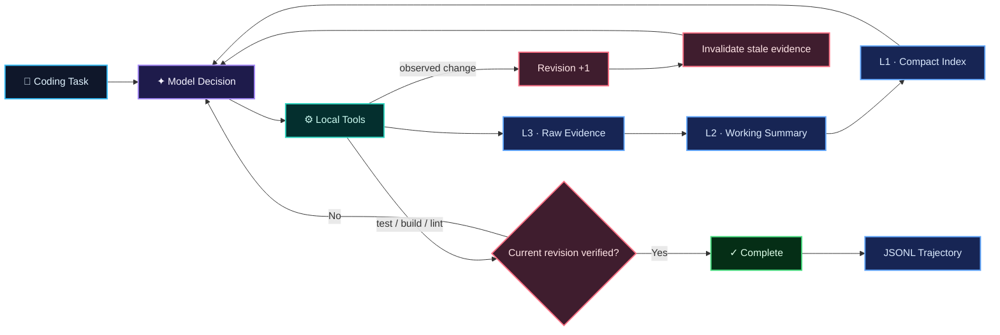

<div align="center">
  

  <br/>

  <a href="#-quick-start"></a>
  <a href="#-testing--evaluation"></a>
  <a href="#-design-principles"></a>
  <a href="#-quick-start"></a>

  <br/><br/>

  <strong>一个轻量、可审计、由执行证据驱动的编程智能体。</strong><br/>
  <sub>不把“模型说完成了”当作完成。工作区发生可观测变化后，必须取得当前 revision 的项目级执行证据。</sub>

  <br/><br/>

  <a href="#-why-proofcode">Why ProofCode</a> ·
  <a href="#-architecture">Architecture</a> ·
  <a href="#-quick-start">Quick Start</a> ·
  <a href="#-layered-context">Context</a> ·
  <a href="#-completion-gate">Verification</a> ·
  <a href="#-security-boundary">Security</a>
</div>

<br/>

> [!NOTE]
> **ProofCode 的核心约束：** `Model completion ≠ Task completion`。工作区发生可观测变化后，旧验证立即失效；只有当前 revision 获得项目级执行证据后，Runtime 才接受完成声明。

## ✦ Why ProofCode

很多最小 Coding Agent 的停止条件其实是：**模型不再调用工具 → 结束。** 但对于真实软件工程任务，这只能证明模型“觉得自己做完了”，不能证明代码真的正确。

ProofCode 把 **模型决策** 与 **程序完成条件** 分离，并围绕两个问题设计：

<table>
<tr>
<td width="50%" valign="top">

### 🛡️ Evidence-gated completion

受控编辑或命令引起文件变化时，workspace revision 自动推进。旧测试、旧构建和旧静态检查结果随即失效；如果当前版本没有新的项目级 validation，ProofCode 会拒绝模型结束任务，并把缺失证据重新反馈给下一轮。

</td>
<td width="50%" valign="top">

### 🧠 Layered context

长任务不再把所有文件、搜索结果和终端输出无限塞回 prompt。ProofCode 将上下文拆成 **L1 索引 / L2 摘要 / L3 原始证据**，模型需要细节时再通过 ID 恢复完整内容。

</td>
</tr>
</table>

## ◈ Architecture



<div align="center">

`Task` → `Reason` → `Tool` → `Evidence` → `Revision` → `Verify` → `Complete`

</div>

## ✨ Core Capabilities

| | Capability | What ProofCode does |
|:--:|---|---|
| 🔁 | **Native Agent Loop** | 直接解析 OpenAI-compatible Chat Completions API 的原生 tool calls，并将结构化结果反馈给模型 |
| 🧠 | **3-Layer Context** | L1 紧凑索引、L2 工作摘要、L3 可按需恢复的完整工具证据 |
| 🧬 | **Revision Awareness** | 成功编辑或命令引起的可观测文件变化推进 revision，旧命令与验证自动标记 stale |
| ✅ | **Evidence Gate** | 普通成功命令和单个 focused test 不足以结束；需要当前 revision 的项目级 validation |
| ✍️ | **Controlled Editing** | 支持唯一文本替换、新文件创建、单文件 unified-diff patch |
| 🔍 | **Diff Review** | 查看相对 Git `HEAD` 的 staged、unstaged 与 untracked 状态 |
| 🖥️ | **Local Execution** | `subprocess.run(..., shell=False)`；限制工作目录、超时与输出长度 |
| 👤 | **Human Approval** | 写文件、应用补丁和执行命令默认需要人工确认 |
| 🧾 | **Audit Trail** | JSONL 保存模型响应、工具调用、验证状态、停止原因与 API usage |
| ♻️ | **Loop Protection** | 最大步骤、重复动作检测、API 重试、协议错误与工具错误分类 |

## 🧰 Tool Surface

```text
╭─ Explore ───────────────────────────────────────────────╮
│  list_files     search_text     read_file               │
├─ Edit ──────────────────────────────────────────────────┤
│  replace_text   create_file     apply_patch             │
├─ Review & Execute ──────────────────────────────────────┤
│  show_diff      run_command                             │
├─ Context ───────────────────────────────────────────────┤
│  list_context   read_context                            │
╰─────────────────────────────────────────────────────────╯
```

`apply_patch` 只处理一个已有 UTF-8 文件中的 unified-diff hunks：不接受文件头，不负责删除或重命名文件；当 patch 上下文与当前文件不一致时，直接拒绝写入。

## 🚀 Quick Start

### 01 · Requirements

- **Python 3.11+**
- 支持原生 **tool calling** 的 OpenAI-compatible API
- **Git**（用于 `show_diff`）
- **0 个第三方 Python runtime dependencies**

### 02 · Configure model

<details open>
<summary><b>PowerShell</b></summary>

```powershell
$env:MODEL_API_KEY="your-api-key"
$env:MODEL_BASE_URL="https://your-provider.example/v1"
$env:MODEL_NAME="your-model-name"
```

</details>

<details>
<summary><b>Windows CMD</b></summary>

```bat
set "MODEL_API_KEY=your-api-key"
set "MODEL_BASE_URL=https://your-provider.example/v1"
set "MODEL_NAME=your-model-name"
```

</details>

程序请求 `{MODEL_BASE_URL}/chat/completions`。API key 只从环境变量读取；不要把真实凭据写入代码、README、终端截图或演示视频。

### 03 · Run

```bat
python -m proofcode --workspace ".\demo-project" "运行测试，定位失败原因并修复，修复后重新运行测试"
```

或者安装为本地可执行命令：

```bat
python -m pip install -e .
proofcode --workspace ".\demo-project" "检查项目并修复失败的测试"
```

默认情况下，所有写操作和命令执行都会请求确认。只有在**隔离且可信**的工作区中才建议：

```bat
python -m proofcode --workspace ".\demo-project" --approve-all "运行测试并修复错误"
```

交互式终端默认使用结构化状态、语义颜色和审批面板；审批时输入 `y` 仅允许当前操作，输入 `a` 则允许本次运行中的当前及后续操作。输出重定向时自动退回纯文本，需要主动关闭 ANSI 颜色时使用 `--no-color`。这些选项不改变工具、revision 或完成门控。

## 🧠 Layered Context

ProofCode 不丢弃长输出，而是改变它们进入模型上下文的方式。

```text
L1  CONTEXT INDEX
│   task · revision · changed files · verification · C/E pointers
│
├── L2  WORKING CONTEXT
│       deterministic summaries of reads / searches / edits / commands
│
└── L3  RAW EVIDENCE
        complete tool output, recoverable by ID + offset via read_context
```

当文件发生修改后，与旧内容相关的读取、搜索、命令和验证条目会被标记为 `stale`。`run_command` 前后也会比较工作区文件元数据，以捕获格式化器、生成器等命令带来的变化。模型仍可审计历史证据，但不能把旧版本的成功测试当成当前版本的完成依据。当前采用 workspace-level 保守失效：即使只修改 README，也会使旧验证失效。

## ✓ Completion Gate

<table>
<tr><th>Workspace state</th><th>ProofCode decision</th></tr>
<tr><td>尚未取得任何 workspace evidence</td><td>🟨 <b>拒绝完成</b>，要求先检查项目</td></tr>
<tr><td>检查后没有观测到工作区变化</td><td>🟦 可以报告分析结果</td></tr>
<tr><td>修改后仅有普通命令或 focused validation</td><td>🟨 <b>拒绝完成</b>，继续 Agent loop</td></tr>
<tr><td>当前 revision 仍有失败 validation</td><td>🟥 <b>拒绝完成</b>，把失败证据反馈给模型</td></tr>
<tr><td>当前 revision 的项目级 validation 通过</td><td>🟩 <b>接受完成声明</b></td></tr>
</table>

验证命令由本地确定性规则识别，覆盖常见的 **Python / Node.js / Go / Rust / .NET / Maven / Gradle / Make** 工作流。显式指定测试文件、用例或单文件检查的命令标记为 `focused`；它们可以提供快速反馈，但完成还需要项目级 baseline。因此，修改 `auth.py` 后只运行 `pytest tests/test_math.py` 不会通过完成门控。

这里的 project-wide 是命令范围上的确定性近似，不是语义相关性或测试完备性的证明。当前系统没有建立 changed-file dependency、coverage 或 test-impact mapping；validation selection 仍由 Agent 提议，Runtime 负责真实执行、范围分类、版本绑定和完成门控。因此它是 evidence executor 和 gatekeeper，不是独立的 correctness verifier：

```text
完成被接受  ⇒ 当前可观测 revision 存在项目级可执行证据
完成被接受  ⇏ 用户需求已被形式化证明
```

当前 gate 是 observed-change-triggered，并不理解完整任务意图。进一步可以引入显式 `analysis` / `modification` 任务契约，以及由 Runtime 选择的固定 baseline 和 test-impact mapping。

## 🧾 Auditable Trajectory

每次运行默认创建：

```text
<workspace>/.proofcode/runs/<run-id>.jsonl
```

事件按时间顺序记录：

```text
run_started
    ↓
step → model_response → tool_call → tool_result
                              ↓
                    verification_rejected
                              ↓
                        run_finished
```

如果模型厂商返回 `usage`，轨迹会保存每轮输入、输出和总 token 数。轨迹不会记录 API key，但可能包含任务文本、代码片段和命令输出，因此 `.proofcode/` 应保持在版本控制之外。

```bat
python -m proofcode --no-trajectory --workspace "." "检查当前项目"
```

## 🧪 Testing & Evaluation

完整测试不需要 API key，也不会产生模型费用：

```bat
python -m unittest discover -v
```

```text
Ran 51 tests
OK
```

当前测试覆盖：模型协议解析、路径隔离、工具参数、补丁匹配、差异审查、上下文恢复、版本失效、验证反馈、循环终止与轨迹写入。

分层上下文回放：

```bat
python -m evaluation.context_replay
```

当前受控回放包含 **18 轮**长工具输出。以序列化字符数作为上下文开销代理，分层策略相对完整线性历史减少约 **70.1%**，同时能够从 L3 恢复全部原始证据。

> [!IMPORTANT]
> `70.1%` 是当前受控回放用于验证机制的结果，不代表所有真实任务、模型或 tokenizer 上固定的 token 节省比例。

## 📦 Project Structure

```text
proofcode/
├── agent.py          # Agent 主循环与完成反馈
├── cli.py            # CLI、批准流程与事件展示
├── config.py         # 环境变量配置
├── context.py        # 对话交换与近期历史裁剪
├── model.py          # OpenAI-compatible 请求与响应解析
├── patching.py       # 受限 unified-diff 解析
├── state.py          # L1/L2/L3、revision 与验证状态
├── tools.py          # 本地工具注册、校验与执行
├── trajectory.py     # JSONL 运行轨迹
├── validation.py     # 测试、构建与静态检查识别
└── types.py          # 核心数据结构

tests/                # 单元测试与脚本化 Agent 流程
evaluation/           # 上下文回放评估
demo/                 # 可重复录制的人工确认、三层上下文与验证门控案例
```

## ◆ Design Principles

1. **Core logic stays visible.** 不依赖 Agent 框架，也不依赖服务端托管文件或代码执行工具。
2. **The model proposes; the program constrains.** 路径、批准、超时、版本和完成条件由本地程序确定。
3. **Preserve evidence, not prompt bloat.** 默认传递索引和摘要，原始证据按需恢复。
4. **Repair with execution feedback.** 失败测试进入下一轮，成功验证才构成完成依据。
5. **Stay small.** 当前保持同步单 Agent 循环，不引入多智能体、插件或向量数据库。

## 🔐 Security Boundary

ProofCode 限制所有工具路径不能逃逸工作区；命令使用 argv 数组执行并拒绝直接启动 Shell 解释器。但 **ProofCode 不是恶意代码沙箱**：目标仓库中的测试和可执行程序仍可能包含危险行为。

> [!WARNING]
> 对不可信仓库运行 ProofCode 时，请把**整个 ProofCode 进程**放进容器或虚拟机，而不是仅依赖工具层的路径与 Shell 限制。

## 📚 References

- **SWE-agent** — Agent-Computer Interface 与面向模型的工具反馈设计 · [Paper](https://arxiv.org/abs/2405.15793)
- **mini-SWE-agent** — 小型、线性的 coding-agent harness · [Repository](https://github.com/SWE-agent/mini-swe-agent)
- **Generative Agents** — 分层记忆、检索与反思的长期 Agent 设计 · [Paper](https://arxiv.org/abs/2304.03442)
- **Agentless** — 软件问题定位、修复与验证的阶段化思路 · [Paper](https://arxiv.org/abs/2407.01489)

ProofCode 没有复制上述项目的 Agent 实现。项目保留标准的 **model → tool → feedback** 循环，并针对代码状态变化、长工具输出和过早完成问题实现自己的轻量机制。

<br/>

<div align="center">
  
  <sub><b>ProofCode</b> · Make completion a claim backed by evidence.</sub>
</div>
